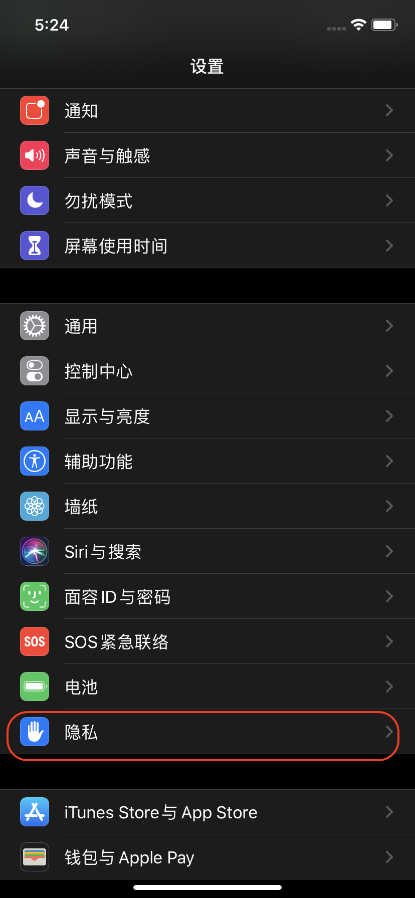

### 前言

经常会遇到，线上极个别用户反馈出现闪退，而且这几个用户反复复现。而自己同样的机型，同样的包进行了一样的操作没有任何问题的情况。有时可以通过Crash统计平台等看到用户发生Crash，定位到原因，但是经常会发生各种平台都统计不到，但是用户确实发生了Crash。如何解决呢？

### 问题分析

iPhone手机，每个应用发生crash，都会保存在手机里面。可以根据如下流程拿到用户的崩溃日志：



 


从真机中获取到对应APP的ips文件。打开ips文件，可以看到crash的调用栈：


从文件可以看出，crash用户的手机型号、手机系统版本、使用的APP版本以及报错栈信息等。

若能拿到真机的情况下，在不删掉APP的情况下，可以直接调试；无法复现的问题，则可以把真机插到电脑上，打开Xcode→ Window→ Devices and Simulators → View Device Logs，直接找到需要的 log。

若拿不到真机参考下述方法

#### 1.获取ips文件

通过上述截图，导出.ips文件，将文件名修改为 `.crash` 后缀，使其标识为 `crash` 类型

#### 2.获取dSYM文件

.dSYM 文件：debugging SYMBols，调试符号表。从打包真机（如果是通过打包隔离构建的）或本级上导出一份与用户设备中安装的APP版本一致的 .dSYM文件，该文件详细记录了16进制下的函数地址的映射信息。

PS：

1）Xcode的默认设置是会在release和debug环境下配置好archive时自动导出.dSYM文件，如果在打包是发现没有导出.dSYM文件，可以到Xcode的Build Setting 中查看`Debug Infomation Format` 字段的配置进行修改

2）.dSYM文件对于后续排查问题非常重要，每一次release版本都最好保存对应的dSYM文件或者把Archives文件进行保存

#### 3.symbolicatecrash工具

symbolicatecrash 工具。该工具跟随 Xcode，是获取符号化结果的最方便工具。symbolicatecrash 的地址视 Xcode 的安装路径而定，大致的地址为：

```
你的Xcode安装路径/Xcode.app/Contents/SharedFrameworks/DVTFoundation.framework/Versions/A/Resources/symbolicatecrash
```

#### 4.获取崩溃代码信息

有了 `.ips` 文件、`.dSYM` 文件和 `symbolicatecrash` 工具后就可以直接进行解析日志了

将这是三个文件统一放在一个文件夹中，如下图：


打开终端执行命令：

./symbolicatecrash ./Benifit.crash ./Benifit.app.dSYM > crash.log

```text
# 执行符号化
symbolicatecrash [原始CrashLog路径] [dSYM文件路径或待符号的.app路径] > [导出符号化的文件路径]
```

命令执行完之后，当前文件夹会生产一个crash.log的文件，如下图所示：


打开crash.log文件


可以定位到是[NSString stringWithFormat:]方法引起的crash。

但是代码中使用[NSString stringWithFormat:]方法很多无法定位到具体是那个问题，那么可以执行如下命令：

atos -o Benifit.app.dSYM/Contents/Resources/DWARF/Benifit -arch arm64 -l 0x1008c8000 0x0000000100c09da8

```text
atos -o [镜像的DWAF文件地址] -l [镜像的起始地址] [堆栈内存地址1] [堆栈内存地址2] ...
  汇编定位法
```


0x1008c8000 和 0x0000000100c09da8 这两个地址是什么意思呢？我们再看这张图


0x1008c8000 为 `local address`，0x0000000100c09da8 为 `address`

执行结果如下:


定位到对应的调用方法和类为：+[NSObject(Swizzling) getMethodCaller] (in Benifit) (NSObject+Swizzling.m:44)，去查看和解决该方法存在的问题即可。

接下来就可以把多个地址进行解析，配合着在堆栈中的这几个关键信息基本上就可以定位到具体的 crash 代码文件和行数。

### 其他工具

lldb：在日常使用 Xcode 进行开发的过程中已经非常熟悉了，是 Xcode 的默认调试器。示例：


### 扩展

crash信息分析


参考资料：

[官方文档](https://developer.apple.com/library/archive/technotes/tn2151/_index.html#//apple_ref/doc/uid/DTS40008184-CH1-INTRODUCTION)

[iOS开发同学的arm64汇编入门](https://blog.cnbluebox.com/blog/2017/07/24/arm64-start/)

[内存泄漏检查及原因分析](http://192.168.1.50:8090/pages/viewpage.action?pageId=12454361)

